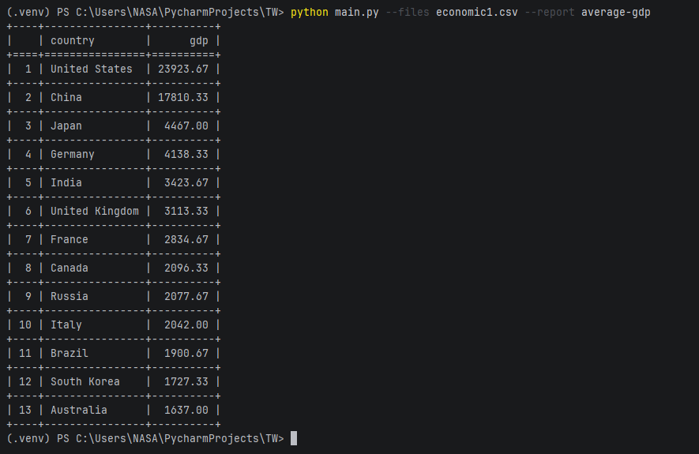

## Консольное приложение для анализа экономических данных из CSV файлов.

### Требования:

- Python 3.10+
- tabulate, pytest, pytest-cov (из requirements.txt)

## Запуск

Скрипт принимает список файлов и название отчета. Файлы должны находиться в одной директории со скриптом. Результат выводится в консоль в виде таблицы. 

```bash
python main.py --files economic1.csv --report average-gdp
```


## Архитектура и масштабируемость
Проект спроектирован с учетом легкого добавления новых типов отчетов:
- Чтобы добавить новый отчет, нужно создать новый класс в `reports.py`, унаследованный от базового класса `Report`, и зарегистрировать его в словаре `report_registry` в `main.py`.
- Логика чтения файлов (`data_loader`), расчетов (`reports`) и вывода (`display`) изолирована друг от друга, что упрощает поддержку и тестирование каждой части по отдельности.

## Пример работы
